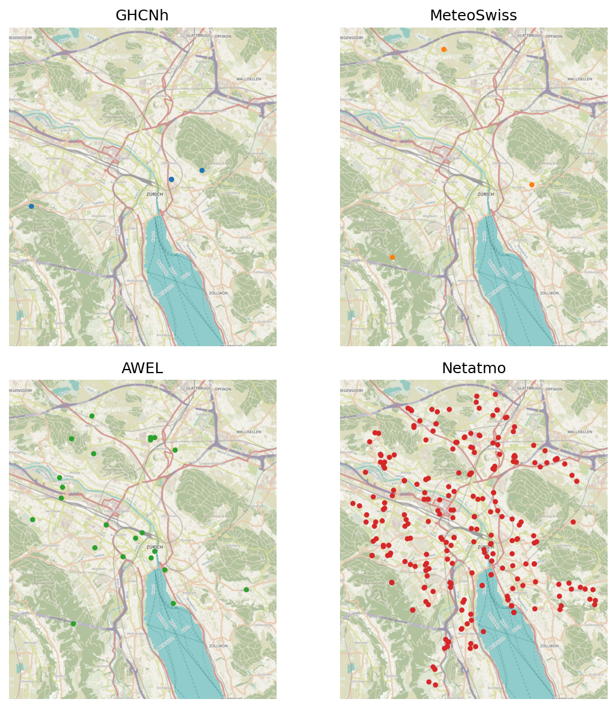

# Summary

Ground-based meteorological station observations are central to research across a wide variety of fields including atmospheric science, hydrology, agriculture and urban climate. Nevertheless, working with these observations in practice can be laborious: data providers, e.g., national weather services, research and agricultural networks, local or regional low-cost sensor (LCS) networks, and crowdsourced citizen weather stations (CWS), usually expose different API or file formats, station-metadata schemas, variable naming, unit conventions and time references. Researchers therefore spend substantial effort writing code to acquire and preprocess data before any analysis can begin.

In order to streamline this process, Meteora defines a **common data model** for in-situ station observations and provides an extensible set of provider clients that map heterogeneous sources onto this unified representation. Each provider is implemented as a `BaseClient` subclass exposing the same interface, so that for every supported provider:

- the `stations_gdf` property provides the station metadata as a geopandas geo-data frame [@fleischmann2026geopandas] with point geometries that encode station locations in an explicit coordinate reference system
- the `get_ts_df` method provides the measurements as a timezone-aware pandas time series data frame [@mckinney2010data], whose variables follow a controlled vocabulary based on the surface meteorological Essential Climate Variables (ECVs) defined by the Global Climate Observing System [@bojinski2014concept] and carry explicit physical units through Pint [@grecco2024pint].

These measurements can be obtained in the long- and wide-form data-frame layouts common to statistical and time-series workflows [@wickham2014tidy], and can additionally be assembled into vector data cubes [@pebesma2022vdc] using the xvec package [@fleischmann2024xvec], providing a single data structure that indexes measurements simultaneously in space and time. Because every provider shares this common interface, the same `get_ts_df` call returns the same, analysis-ready structure regardless of the underlying provider, so downstream code can be written once and run seamlessly against any source.

This harmonized data model is the foundation on which Meteora builds **provider-agnostic capabilities**:

- a configurable **quality control (QC) pipeline** of composable *flagging* and *transforming* steps that can be reordered, parameterized or extended with user-defined callables, based on the CWS QC methods of @napoly2018qc and CrowdQC+ [@fenner2021crowdqc] to detect mislocated, unreliable, indoor and radiatively-biased stations;
- **radiation-bias correction** [@bosch2026revisiting] of air temperature measurements, designed for LCS, with corrections specific to each sensor model; and
- the computation of **climate indices** over station observations with xclim [@bourgault2023xclim] and xarray [@hoyer2017xarray], tools conventionally applied to gridded climate data.

The result is a single, coherent interface that makes it easy to acquire, harmonize and process station observations from any provider, turning heterogeneous sources into analysis-ready data.

# Statement of need

For surface meteorological data, globally harmonized sources can broadly be categorized into two main classes, i.e., gridded products such as the ERA5 reanalysis and global station compilations such as the Global Historical Climatology Network (GHCN). While reanalysis products directly integrate station observations using data assimilation pipelines, they tend to operate at spatial scales too coarse for many applications as well as to smooth away local extremes. Global station compilations, in turn, ingest only the networks exchanged internationally (largely official synoptic and airport/aviation stations, often the same ones the reanalyses assimilate), leaving them too sparse for data-scarce regions [@vandegiesen2014tahmo] and for resolving urban climate [@muller2013sensors; @baklanov2018urban]. Capturing this fine-scale variability requires combining the national, regional and crowdsourced networks those products omit (\autoref{fig:coverage}) — the central motivation behind Meteora.

Meteora targets researchers and practitioners who need to access station observations from potentially many heterogeneous sources, harmonize them into a single analysis-ready dataset, and apply common processing and analysis such as quality control, radiation-bias correction or climate-index computation, without writing ad-hoc per-provider code. Example use cases include urban climate modeling, station-density and network-representativeness assessments, or comparison of CWS against reference observations.

# State of the field

Accessing meteorological station data is fragmented across providers. In some cases, individual networks are served by single-source packages that return data in a provider-specific schema and are often unmaintained. An example of a broader tool is meteostat [@lamprecht2021meteostat], which aggregates a curated set of stations into its own store and lets users openly access a harmonized collection through its API and Python package. However, meteostat covers mainly official networks — omitting the regional and crowdsourced stations that densify local, and especially urban, observations — and exposes no abstraction for users to add providers of their own. On the other hand, wetterdienst [@wetterdienst] fetches and harmonizes directly from several national weather services under one interface, making it the closest analog to Meteora; nevertheless it shares the same limitations as meteostat, i.e., supporting a fixed, built-in provider set covering only official networks. Commercial APIs such as Synoptic (exposed in Python through the SynopticPy package) require a paid subscription and remain provider-mediated. There is consequently no unified, extensible layer that covers official, regional, low-cost and crowdsourced networks, lets users easily add clients for new ones, and turns their heterogeneous observations into a single, standardized, analysis-ready representation.

This data harmonization transforms observations into a single, analysis-ready format so that the downstream tasks that normally demand ad-hoc preprocessing become straightforward. A notable example is quality control, which is usually done through dedicated packages such as TITAN [@baaserud2020titan], CrowdQC+ [@fenner2021crowdqc] and the MetObs-toolkit [@vergauwen2024metobs], which assume the user already holds harmonized files — Meteora instead couples acquisition and quality control within one interface. Similarly, climate indices can be computed directly on this harmonized output with xclim [@bourgault2023xclim], thus eliminating the need of per-provider preprocessing that such analyses would otherwise require.

# Software design

A central goal of Meteora is to make supporting a new weather service straightforward. Each provider is a `BaseClient` subclass built on a small collection of endpoint-specific **abstract base classes** (for JSON, plain-text and file-based endpoints) together with composable mixins that encapsulate the recurring patterns of station-data retrieval: partitioning requests by station, time period or variable as required by each API, request caching, and the harmonization steps of variable renaming, unit attachment and timezone localization. Because every provider is a thin mapping onto the shared data model, adding a source amounts to writing a new `BaseClient` subclass: declaring a handful of attributes (endpoints, identifier columns, the ECV mapping and the source timezone) and implementing a parsing method that reshapes the provider's response into the common long form. The new client then exposes the same harmonized `stations_gdf` and `get_ts_df` interface. A step-by-step guide to writing a client is included in the documentation. The released version ships clients spanning official, regional and crowdsourced networks: AEMET (Spain), Agrometeo and AWEL (Switzerland), the Iowa Environmental Mesonet (ASOS and METAR networks), NOAA GHCN-hourly, Meteocat (Catalonia), MeteoSwiss, and the Netatmo citizen weather station network.

# Research impact statement

Meteora has already been used in research to produce the observational basis of two studies of urban climate in Switzerland, and the same harmonized interface underpins a broader set of applications:

- **Multi-provider and data-fusion studies.** Combining professional automatic weather stations from national weather services with higher-density local, regional and crowdsourced (CWS) networks, e.g., for urban heat island analysis, station-density and network-representativeness assessments [@bosch2026representative], or comparison of CWS against reference observations.
- **QC and bias correction of low-cost and crowdsourced networks.** Applying and customizing CWS QC, with the same pipeline running seamlessly across providers. The Meteora QC module implements most of the methods of the CrowdQC+ R package [@fenner2021crowdqc; @napoly2018qc; @meier2017crowdsourcing], allows user-defined steps, and adds further corrections such as elevation adjustment and sensor-model-specific radiation-bias correction of LCS [@bosch2026revisiting].
- **Higher-resolution climate indices.** Computing indices directly from station networks with xclim, rather than from the gridded products, can resolve local detail that gridded aggregations smooth away. Additionally, integrating regional and crowdsourced stations to the official networks can dramatically change the result, as shown for urban heat indices in Switzerland [@bosch2026revisiting].
- **Benchmarking weather-forecast models.** Evaluating forecasts against in-situ station observations, rather than the reanalysis grids often used as ground truth, better reflects the site-specific conditions that are usually smoothed in the gridding process. Meteora's harmonized, space-time-indexed output feeds directly into forecast-evaluation pipelines such as stationbench [@stationbench; @molinaro2025ept2].

# Availability

Meteora is released under the GPL-3.0-or-later license. The source code has been publicly developed on GitHub at [github.com/martibosch/meteora](https://github.com/martibosch/meteora) since 2023, and versioned releases are distributed via [the Python Package Index](https://pypi.org/project/meteora) and [conda-forge](https://anaconda.org/conda-forge/meteora) since October 2024. The documentation is hosted on [Read the Docs](https://meteora.readthedocs.io) and includes the API reference, a user guide with executable example notebooks that showcase the capabilities and applications of Meteora as well as developer guidelines for contributions. Continuous integration runs both the pre-commit style checks using [pre-commit.ci](https://pre-commit.ci/) and the unit-test suite on every push via GitHub Actions, with [test coverage reported on Codecov](https://app.codecov.io/gh/martibosch/meteora).

# AI usage disclosure

Generative AI assistance (Anthropic Claude, models in the Claude 4 family) was used during development for code refactoring, drafting documentation, and copy-editing this manuscript. All AI-assisted output was reviewed and validated by the author, who made all design and architectural decisions.

# Acknowledgements

Meteora builds on the scientific Python ecosystem, in particular pandas [@mckinney2010data], NumPy [@harris2020array], geopandas [@fleischmann2026geopandas], xarray [@hoyer2017xarray], xclim [@bourgault2023xclim], Pint [@grecco2024pint] and Pooch [@uieda2020pooch].

# References
